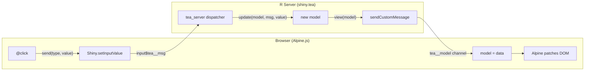

# shiny.tea Package Implementation Plan

## Architecture

The package extracts the generic runtime loop from `alpine-rebuild` and provides a clean API for building Shiny apps with unidirectional data flow. The user defines three pure functions (`init`, `update`, `view`) and HTML with Alpine directives. The package handles all WebSocket plumbing.



## Package structure

```
shiny.tea/
  DESCRIPTION
  NAMESPACE
  LICENSE
  R/
    server.R          # tea_server()
    page.R            # tea_page(), tea_bridge_js()
    module.R          # tea_module_ui(), tea_module_server()
    inputs.R          # tea_button(), tea_select(), tea_checkbox(), tea_slider()
    enum.R            # tea_enum(), match_enum()
    utils.R           # list_set()
    testing.R         # tea_dispatch()
  inst/
    examples/
      counter/app.R   # Minimal counter example
  tests/
    testthat.R
    testthat/
      test-server.R
      test-enum.R
      test-utils.R
      test-inputs.R
      test-dispatch.R
  man/               # Generated by roxygen2
```

## Core API (6 files)

### 1. `R/utils.R` -- Immutable update helper

Single export. Extracted directly from [alpine-rebuild/R/tea-update.R](alpine-rebuild/R/tea-update.R) lines 6-9:

```r
#' @export
list_set <- function(.l, ...) {
  updates <- list(...)
  for (nm in names(updates)) .l[[nm]] <- updates[[nm]]
  .l
}
```

### 2. `R/enum.R` -- Message types with exhaustive matching

Adapted from the [Sanofi teal.builder enum pattern](https://github.com/Sanofi-Public/teal.builder/blob/main/R/enums.R). Two exports:

- `tea_enum(values)` -- returns a factory function that creates validated enum values. Replaces per-app `enum_msg()` definitions:

```r
#' @export
tea_enum <- function(values) {
  force(values)
  function(x) {
    if (!x %in% values) {
      stop(sprintf("Unknown message '%s'. Valid: %s", x, paste(values, collapse = ", ")))
    }
    structure(factor(x, levels = values), class = c("tea_enum", "factor"))
  }
}
```

- `match_enum(enum, ..., .default)` -- exhaustive pattern matching using formula syntax. Without `.default`, requires all levels to be handled:

```r
#' @export
match_enum <- function(enum, ..., .default) {
  cases <- list(...)
  env <- parent.frame()
  parsed <- unlist(lapply(cases, function(f) {
    lhs <- eval(rlang::f_lhs(f))
    rhs <- rlang::f_rhs(f)
    setNames(rep(list(rhs), length(lhs)), lhs)
  }), recursive = FALSE)

  lvls <- levels(enum)
  invalid <- setdiff(names(parsed), lvls)
  if (length(invalid) > 0) stop(sprintf("Unknown levels: %s", paste(invalid, collapse = ", ")))

  if (missing(.default) && !setequal(names(parsed), lvls)) {
    missing_lvls <- setdiff(lvls, names(parsed))
    stop(sprintf("Unhandled messages: %s", paste(missing_lvls, collapse = ", ")))
  }

  key <- as.character(enum)
  expr <- parsed[[key]]
  if (is.null(expr)) {
    if (missing(.default)) stop(sprintf("No match for '%s'", key))
    return(eval(.default, envir = env))
  }
  eval(expr, envir = env)
}
```

### 3. `R/page.R` -- UI wrapper with Alpine.js

Two functions:

- `tea_page(...)` -- wraps content with Alpine CDN, bridge JS, x-cloak CSS. Based on the generic portion of [alpine-rebuild/R/tea-runtime.R](alpine-rebuild/R/tea-runtime.R) lines 26-54:

```r
#' @export
tea_page <- function(..., component = "tea", theme = bslib::bs_theme(),
                     extra_js = NULL, extra_channels = NULL) {
  bslib::page_fillable(
    theme = theme,
    padding = 0,
    tags$head(
      tags$style(HTML("[x-cloak]{display:none!important}")),
      tea_bridge_js(component, extra_js = extra_js, extra_channels = extra_channels),
      tags$script(
        src = "https://cdn.jsdelivr.net/npm/alpinejs@3/dist/cdn.min.js",
        defer = NA
      )
    ),
    div(`x-data` = component, `x-cloak` = NA, ...)
  )
}
```

- `tea_bridge_js(component, ns, extra_js, extra_channels)` -- generates the Alpine.data registration with parameterized channel names. The bridge JS is generated inline (not a file) so that channel names can be customized per component/module:

```r
tea_bridge_js <- function(component = "tea", ns = identity,
                          extra_js = NULL, extra_channels = NULL) {
  model_channel <- paste0(component, "__model")
  msg_id <- ns(paste0(component, "__msg"))

  # extra_channels: named list of channel -> "self.propName = data;"
  extra_handlers <- ""
  if (!is.null(extra_channels)) {
    extra_handlers <- paste(vapply(names(extra_channels), function(ch) {
      sprintf('Shiny.addCustomMessageHandler("%s", function(data) { %s });',
              ch, extra_channels[[ch]])
    }, character(1)), collapse = "\n")
  }

  js <- sprintf('
    document.addEventListener("alpine:init", function() {
      Alpine.data("%s", function() {
        return {
          model: {},
          init: function() {
            var self = this;
            Shiny.addCustomMessageHandler("%s", function(data) {
              self.model = data;
            });
            %s
          },
          send: function(type, value) {
            Shiny.setInputValue("%s",
              { type: type, value: value === undefined ? null : value },
              { priority: "event" }
            );
          },
          shinySet: function(name) {
            Shiny.setInputValue(name, Date.now(), { priority: "event" });
          }
          %s
        };
      });
    });
  ', component, model_channel, extra_handlers, msg_id,
     if (!is.null(extra_js)) paste0(",\n", extra_js) else "")
  tags$script(HTML(js))
}
```

The `extra_js` parameter lets users inject keystroke-sensitive computed properties (like `filteredRegistry` or `configParams`) into the Alpine component. The `extra_channels` parameter adds custom Shiny message handlers (like clipboard).

### 4. `R/server.R` -- Reactive runtime loop

The core of the package. Extracted from [alpine-rebuild/R/tea-runtime.R](alpine-rebuild/R/tea-runtime.R) lines 997-1021 and 1094-1155:

```r
#' @export
tea_server <- function(init, update, view,
                       component = "tea",
                       on_msg = NULL,
                       input, output, session) {
  model_channel <- paste0(component, "__model")
  msg_input <- paste0(component, "__msg")

  model <- reactiveVal(init())

  push <- function() {
    session$sendCustomMessage(model_channel, view(model()))
  }

  session$onFlushed(function() {
    session$sendCustomMessage(model_channel, view(isolate(model())))
  })

  observe({ push() })

  observeEvent(input[[msg_input]], {
    msg <- input[[msg_input]]
    type <- msg$type
    value <- msg$value

    # on_msg: optional hook for side effects or interception
    # Returns TRUE to proceed with update(), FALSE to skip
    if (!is.null(on_msg)) {
      proceed <- on_msg(model, type, value, session)
      if (isFALSE(proceed)) return()
    }

    new_model <- update(model(), type, value)
    model(new_model)
  })

  # Return model reactiveVal so user can build Shiny islands
  model
}
```

The `on_msg` callback receives `(model_rv, type, value, session)` where `model_rv` is the reactiveVal itself (not its value), allowing the hook to both read and write. Returning `FALSE` skips the default `update()` call -- useful for messages that are pure side effects (clipboard, notifications). Returning anything else (including `NULL` or `TRUE`) proceeds with the update.

### 5. `R/module.R` -- Shiny module support

Handles namespacing so multiple TEA components don't collide on message channels. The component name incorporates the module namespace:

```r
#' @export
tea_module_ui <- function(id, ..., component = "tea", theme = bslib::bs_theme(),
                          extra_js = NULL, extra_channels = NULL) {
  ns <- NS(id)
  comp_id <- ns(component)
  tagList(
    tags$style(HTML("[x-cloak]{display:none!important}")),
    tea_bridge_js(comp_id, ns = ns, extra_js = extra_js, extra_channels = extra_channels),
    tags$script(
      src = "https://cdn.jsdelivr.net/npm/alpinejs@3/dist/cdn.min.js",
      defer = NA
    ),
    div(`x-data` = comp_id, `x-cloak` = NA, ...)
  )
}

#' @export
tea_module_server <- function(id, init, update, view,
                              component = "tea", on_msg = NULL) {
  moduleServer(id, function(input, output, session) {
    comp_id <- session$ns(component)
    tea_server(
      init = init, update = update, view = view,
      component = comp_id, on_msg = on_msg,
      input = input, output = output, session = session
    )
  })
}
```

### 6. `R/inputs.R` -- Declarative message-dispatching inputs

Inputs that auto-wire `@click` / `@change` to `send()`. Based on our earlier discussion, buttons and discrete inputs (select, checkbox, slider) dispatch messages directly. Text inputs bind to Alpine-local state:

```r
#' @export
tea_button <- function(label, msg, value = NULL, class = "btn btn-primary", ...) {
  value_js <- if (is.null(value)) {
    ""
  } else if (is.character(value)) {
    sprintf(", '%s'", value)
  } else {
    sprintf(", %s", jsonlite::toJSON(value, auto_unbox = TRUE))
  }
  tags$button(class = class, `@click` = sprintf("send('%s'%s)", msg, value_js), ..., label)
}

#' @export
tea_button_expr <- function(label, msg, value_expr, class = "btn btn-primary", ...) {
  tags$button(class = class, `@click` = sprintf("send('%s', %s)", msg, value_expr), ..., label)
}

#' @export
tea_select <- function(label, choices, msg, value_expr, ...) {
  tagList(
    tags$label(class = "form-label", label),
    tags$select(
      class = "form-select",
      `x-bind:value` = value_expr,
      `@change` = sprintf("send('%s', $event.target.value)", msg),
      ...,
      tags$option(value = "", "Select..."),
      lapply(choices, function(ch) tags$option(value = ch, ch))
    )
  )
}

#' @export
tea_checkbox <- function(label, msg, checked_expr, ...) {
  div(class = "form-check",
    tags$input(type = "checkbox", class = "form-check-input",
      `x-bind:checked` = checked_expr,
      `@change` = sprintf("send('%s', $event.target.checked)", msg), ...),
    tags$label(class = "form-check-label", label)
  )
}

#' @export
tea_slider <- function(label, min, max, msg, value_expr, step = 1, ...) {
  tagList(
    tags$label(class = "form-label", label),
    tags$input(type = "range", class = "form-range",
      min = min, max = max, step = step,
      `x-bind:value` = value_expr,
      `@change` = sprintf("send('%s', Number($event.target.value))", msg), ...)
  )
}
```

No `tea_text_input` is provided. Text inputs should use `x-model` with Alpine-local state, as documented in the vignette. The package README should explain why.

### 7. `R/testing.R` -- Pure function test helpers

Since `update` is pure, testing doesn't need Shiny. One export:

```r
#' @export
tea_dispatch <- function(init, update, messages) {
  model <- if (is.function(init)) init() else init
  for (msg in messages) {
    type <- if (is.list(msg)) msg$type else msg
    value <- if (is.list(msg)) msg$value else NULL
    model <- update(model, type, value)
  }
  model
}
```

Usage:

```r
test_that("increment and decrement", {
  result <- tea_dispatch(
    init = function() list(count = 0),
    update = my_update,
    messages = list("increment", "increment", "decrement")
  )
  expect_equal(result$count, 1)
})
```

## Example app (`inst/examples/counter/app.R`)

A minimal working example that demonstrates the full pattern:

```r
library(shiny)
library(shiny.tea)

Msg <- tea_enum(c("increment", "decrement", "reset"))

init <- function() list(count = 0)

update <- function(model, msg, value = NULL) {
  match_enum(Msg(msg),
    "increment" ~ list_set(model, count = model$count + 1),
    "decrement" ~ list_set(model, count = model$count - 1),
    "reset"     ~ list_set(model, count = 0)
  )
}

view <- function(model) {
  list(
    count = model$count,
    is_zero = model$count == 0
  )
}

ui <- tea_page(
  div(class = "container py-5 text-center",
    tags$h1(`x-text` = "model.count", class = "display-1"),
    div(class = "d-flex gap-2 justify-content-center mt-3",
      tea_button("-", msg = "decrement", class = "btn btn-outline-primary btn-lg"),
      tea_button("+", msg = "increment", class = "btn btn-primary btn-lg"),
      tags$button(
        class = "btn btn-outline-secondary",
        `x-show` = "!model.is_zero",
        `@click` = "send('reset')",
        "Reset"
      )
    )
  )
)

server <- function(input, output, session) {
  tea_server(init = init, update = update, view = view,
             input = input, output = output, session = session)
}

shinyApp(ui, server)
```

## Dependencies

- **Imports**: `shiny (>= 1.7.0)`, `bslib`, `htmltools`, `jsonlite`, `rlang`
- **Suggests**: `testthat (>= 3.0.0)`
- No dependency on `purrr`, `teal`, or any teal-related package.

## What the package does NOT include

- CSS framework or component library (users bring their own via `bslib`)
- Routing, state persistence, or undo/redo
- Text input helper (deliberately omitted -- documented trade-off with network latency)
- Alpine.js bundled (loaded from CDN; users can override via `extra_js` or custom `tags$script`)
